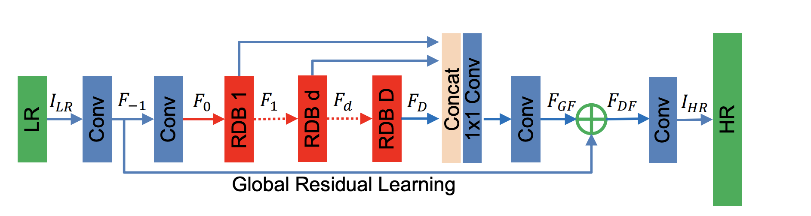
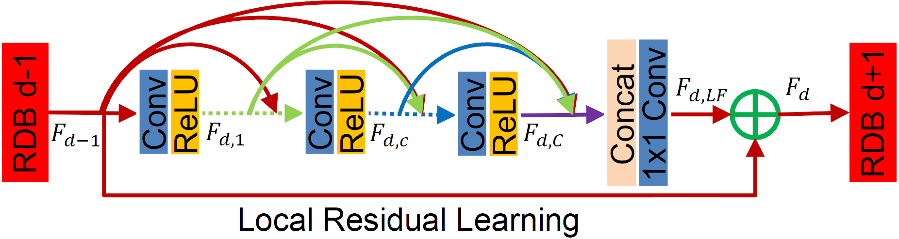

# Denoising mel-spectrograms with a residual dense network


## Setup

```bash
# clone the repo
git clone https://github.com/sdll/audio-denoising
cd audio-denoising
docker build --tag audio-denoising:1.0 .
```

## Run

```bash
docker run -v path_to_dataset:/dataset -v path_to_results:/results --name audio-denoising:1.0
```

### Options

- Options for the model, matching with the weights
  - `--num-blocks` (D): the number of residual dense blocks (RDB)
  - `--num-features` (G0): the number of feature maps for the conv layers outside RDBs and the number of filters in the RBD output
  - `--growth-rate` (G): the number of feature maps of each convolutional layer inside RDBs
  - `--num-layers` (C): the number of convolutional layers stacked inside a RDB
  - `--kernel-size`: the kernel size for non-1x1 convolutions
  - `--num-channels`: the number of channels in the input


<br>


- `--source-dir`: the alternative path replacing /dataset in the example above
- `--target-dir`: the alternative path replacing /results in the example above

- `--denoised-subdir` (default: denoised): where to write the denoised spectograms
- `--extension` (default: npy): the extension for files storing mel-spectograms
- `--weights` (default: `./weights/audio_denoising_psnr_65.1736_epoch_15_D_20_C_6_G_16_G0_16.pth`): path to the weights
- `--threshold` (default: 0.77): the SSIM threshold for determining whether the original image is noisy or not (see [`./demo.ipynb`](./demo.ipynb) for the justification)
